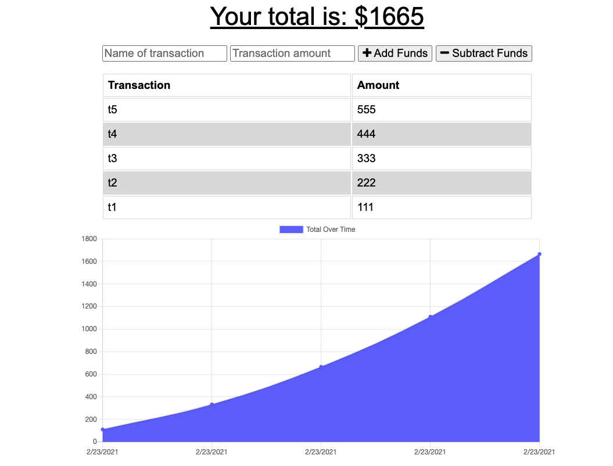

# Budget Tracker!

## Description 
This is a web-application demonstrating the use of PWA features such as offline functionality.

## Table of Contents (Optional)

* [Usage](#usage)
* [Tests](#tests)
* [Credits](#credits)
* [License](#license)

## Usage 
* To install: 
* To run: 
* Access at: https://floating-shelf-15662.herokuapp.com
* Screenshot:

## Tests
1. Clear cache, indexedDB and mongoDB 
2. Start app and go offline
3. POST - offline - Add t1, t2, t3 --> should go in indexedDB
4. Go online ---> t1, t2, t3 now removed from IndexedDB and added to mongoDB
5. POST - online - add t4, t5 --> get added to mongoDB
6. GET - online - reload page --> t1-t5 displayed on page
7. GET - offline - reload page --> t1-t5 displayed on page
## Credits
* UoT FSF Bcamp - this template
* Week-18 - PWA activities
* MDN - Using IndexedDB - Web APIs

## License

MIT License

---
© 2019 Trilogy Education Services, a 2U, Inc. brand. All Rights Reserved.
